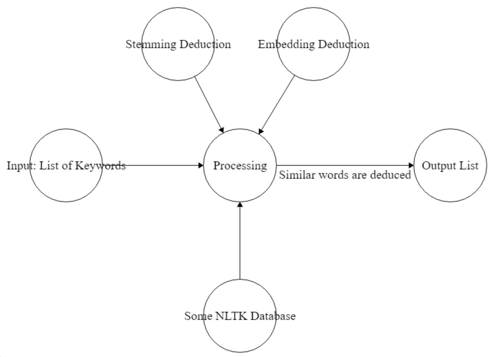

# keyword-deduplication

<!-- TABLE OF CONTENTS -->

  
Table of Contents

  <ol>
    <li>
      <a href="#about-the-project">About The Project</a>
      <ul>
        <li><a href="#built-with">Built With</a></li>
      </ul>
    </li>
    <li>
      <a href="#getting-started">Getting Started</a>
      <ul>
        <li><a href="#prerequisites">Prerequisites</a></li>
      </ul>
    </li>
    <li><a href="#usage">Usage</a></li>
    <li><a href="#design">Design</a></li>
    <li><a href="#algorithm">Algorithm</a></li>
  </ol>

<!-- ABOUT THE PROJECT -->
## About The Project

  This module is built to handle the task of grouping together/eliminating keywords/phrases that are very similar to each other (e.g. such as “database” and “databases”, or "database system" and "database algorithms").)
  
  The filtering criteria can be described in the following two ways: 
  
  First, we will do some simple grouping (based on the nlp technique stemming) where only keywords that are grouped should have the same roots but are expressed slightly differently (such as “algorithm” and “algorithms” or “random” and “randomization”).
  
  On the other hand, some phrases may have a more general / semantic notion of similarity (e.g. using embedding-based similarity to group keywords that are very similar). In this more general criteria, we may group together words such as "database", "database systems", and "database algorithms". Or "data mining" and "data mining techniques". Although these words may not have the same root / stem structure, they should still be grouped together since they refer to the same topic.

### Built With

* [NLTK.stem](https://www.nltk.org/api/nltk.stem.html)
* [NPMI Database](https://en.wikipedia.org/wiki/Pointwise_mutual_information)
* [Sematch](https://pypi.org/project/sematch/)
* [Sentence Transformers](https://pypi.org/project/sentence-transformers/)

<!-- GETTING STARTED -->
## Getting Started

To be implemented after the module is finished.

### Prerequisites

To be implemented after the module is finished.

<!-- USAGE EXAMPLES -->
## Usage

To be implemented after the module is finished.

<!-- DESIGN -->
## Design

This module is intended to be placed after the keyword-extraction module to enable future usages of any kind in the whole system.

The module first takes in a list of keywords/key-phrases that appear commonly in Computer Science research fields.

Using the NLTK Stemming libraries, we get rid of all the keywords that have the same stemmings, and group them into one.

Then utilizing multiple semantic-similarity databases and python NLP modules using BERT&Co, we would group keywords/key-phrases that literally mean the same topic.

After the above two steps, we output a deduced list of keywords/phrases that each individual element should be semantically distinct from each other.

<-- ALGORITHM -->
## Algorithm 

<!-- PROJECT LOGO -->
 

  

  <h3 align="center">Work Flow of the Keyword-Deduction Module</h3>

