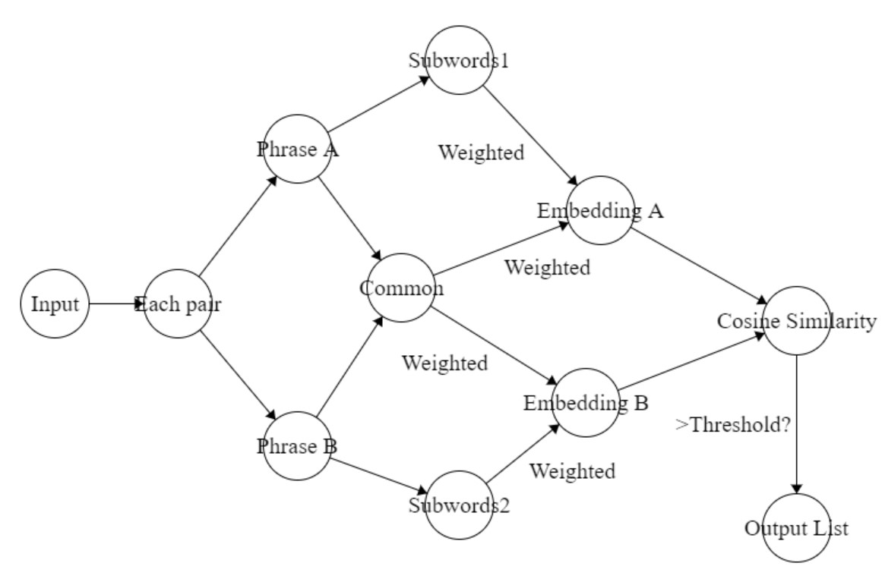

This module is built to handle the task of grouping together/eliminating keywords/phrases that are very similar to each other (e.g. such as “database” and “databases”, or "database strategies" and "database algorithms").)

## Setup

1. Install all the required libraries by running the following command
```
pip install -r requirements.txt 
```

2. Additionally, you may need to install anything related to PyTorch to load the learned Word2Vec model successfully.

3. All the tests and main functions can be found in the main.py file. Just directly run this file with Python.

The following is the breakdown of the repository of this module:
```
keyword_deduplication/
    - requirements.txt
    - word2vec/ 
        -- __init__.py
        -- run.py
        -- word2vec.model
    
   - get_embedding.py
   - main.py
   - phrase_similarity.py
   - similar_word.py
   - setup.py
```

The text description here describing of all the important files / components in this repo. 
* `word2vec/word2vec.model/`: Containing the trained model of word2vec used in this module
* `get_embedding.py`: gets the embedding(vector) of each keyword/phrase in the trained model
* `main.py`: runs the two deduplication functions with users inputs
* `phrase_similarity.py`: implements the functions to achieve the two types of keyword/phrases deduplication(stemming-based, and embedding-based)
* `similar_word.py`: helper functions to check if two keywords/phrases are regarded similar/duplicated.

### Important 
Go to [our shared google Drive space](https://drive.google.com/drive/folders/1rxPAdGTVcl-Xo6uuFovdKcCw5_FEaXIC?usp=sharing) and create a folder with the format `FirstnameLastName-Projectname` (e.g. `AshutoshUkey-KeywordTrie`). In here, make sure to include a zipped copy of any data files related to your module (including `.sql` dumps of necessary databases) as well as a backup zipped copy of your Github repo (i.e. all the files you upload to Github).


## Functional Design (Usage)

* Takes a list of keywords/phrases, and returns the deduplicated version of all these strings using stemming-based deduplication method
```python
    def dedup_by_stemming(keywords):
        ... 
        return [
            'keyword1', 'keyword2',...
        ]
```

* Takes a list of keywords/phrases, and returns the deduplicated version of all these strings using embedding-based deduplication method
```python
    def dedup_by_embedding(keywords):
        ...
        return [
            'keyword1', 'keyword2',...
        ]
```

## Demo video
Make sure to include a video showing your module in action and how to use it in this section. Github Pages doesn't support this so I am unable to do this here. However, this can be done in your README.md files of your own repo. Follow instructions [here](https://stackoverflow.com/questions/4279611/how-to-embed-a-video-into-github-readme-md) of the accepted answer 

[](https://www.youtube.com/watch?v=fgJSYN7pbOM&ab_channel=HaoxiangSun)


## Algorithmic Design 
For the stemming-based keywords/phrases deduplication, we just use the stemming function in the NLTK library. We sequentially compare every pair of input keywords, and if two keywords share the same stemming result, then we will ignore the second one, and keep the first one in the output list.

The embedding-based keywords/phrases deduplication is relatively harder than the previous method. It utilizes the trained model of word2vec. First, similarly, it compares every pair of keywords in the input. But in order to categorize two phrases as similar/duplicated, it finds all the common and distinct subwords of both phrases. Then it generates a new embedding for these two phrases and compare their cosine similarity. If the similarity is above the threshold of 0.75, then they would be categorized as duplicated. 

<!-- PROJECT LOGO -->
<br />
<p align="center">
  <a href="https://github.com/Forward-UIUC-2021F/keyword-deduplication">
    
  </a>

  <h3 align="center">Work Flow of the Keyword-Deduction Module</h3>

</p>
Example and Explanation:
If the two phrases A = "Database Technique" and B = "Database Techniques" are in the input list, when examining this pair, their Common would be {"Database": 1.6}, and the SubWords1 = {"Technique": 1} and SubWords2 = {"Techniques": 1}. In order to make this model more comprehensive, we would use the trained model to extend the Subwords array by their similar words, each coming with a trained similarity.
For example, Subwords1 may be changed to {"Technique": 1, "Method": 0.89, "Methodology": 0.84", "Techniques": 0.8", "Strategy": 0.75}, and Subwords2 may be changed to something very similar {"Techniques": 1, "Methods": 0.89, "Algorithms": 0.82", "Technique": 0.8", "Strategies": 0.7}.
Next, for each word in Common and Subwords1, we extract its embedding(vector) in the trained model, multiply which by its factor shown above, and add them together to make Embedding A. The same goes for Embedding B.
Finally, we just need to compare the Cosine Similarity between these two vectors, and if it's greater than 0.75, then we would categorize them as the pair of phrases that can be deduplicated.


## Issues and Future Work

In this section, please list all know issues, limitations, and possible areas for future improvement.

* The stemming-based keywords deduplication could not be generalized to phrase deduplication. That is, this function only works for single words
* The embedding-based keywords/phrases deduplication has a good performance, but not always very good. Sometimes it could regard two similar phrases as different.
* In the future, we could consider exploring more into the embedding-based deduplication algorithm, to improve its performance to be just the right amount.

## References: 
Models and papers referred to in this module: 

* Word2vec Model: https://github.com/ashuk203/keywords_forward
* New Embedding Generation Paper: 
Estimator Vectors: OOV Word Embeddings based on Subword and Context Clue
